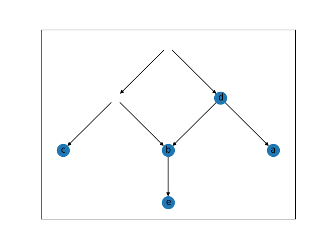

# Triplet Distance
This package provides a Python interface to the Triplet Distance metric.
It is part of the thesis of TMA Levert (5086191) at the Delft University of Technology.
It implements the reconstruction algorithms as discussed in the thesis, as well as the code used to obtain the results in the thesis.
The thesis can be found at https://resolver.tudelft.nl/uuid:a590255b-06dd-4f56-a905-c2f41705f525.

# Usage
For each of the three network types discussed in the thesis, a reconstruction algorithm is provided.
The reconstruction algorithms can be used to reconstruct the triplet distance matrix from a set of triplets.
As input, it takes a set of triplets and the labels of the network.

To easily obtain the triplets of a given network, you can use the network/tree instances to obtain the triplets.
The input for the network/tree classes is a dictionary showing the structure of the network/tree and the labels.
An example of a network is shown below:

```python
from rooted_triplet_distance.level_one_network import Network
network_dict = {"1": 
                    {"d": {"a": {}, 
                           "b": {"e": {}}}, 
                     "2": {"b": {},
                           "c": {}}
                     }
                }
labels = ["a", "b", "c", "d", "e"]
network = Network(network_dict, labels)
network.visualize()
```
This will give you the following network:



# Development

In order to start developing:

-   Make sure you have [git](https://github.com/git-guides/install-git).

-   Have a [python](https://www.python.org/downloads/)
    environment (3.10+) and
    [pip](https://pip.pypa.io/en/stable/installation/#get-pip-py).

-   Have 
    [poetry](https://python-poetry.org/docs/master/#installing-with-the-official-installer)
    installed.

-   Check out the source code:

    `git@github.com:TMALevert/triplet_distance.git`

    or run `git pull --rebase` instead if you already have the code checked out.

-   Create a new branch from the master:

    `git checkout master && git checkout -b <your_new_feature>`

-   Run `poetry update` to setup or update a virtual environment

-   Run `poetry install` to install the package into the virtual
    environment

-   Run `poetry run invoke test` to run tests.

-   You can now start adding new features.

-   Run `poetry run invoke format` to format all code before commiting.

-   Use `git push` to comit changes to your branch and optionally create a pull request to get your
    changes merged.
